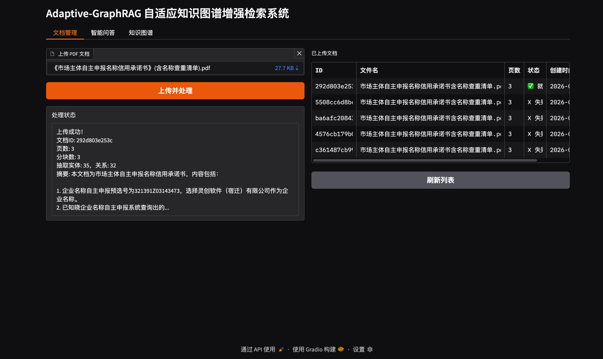
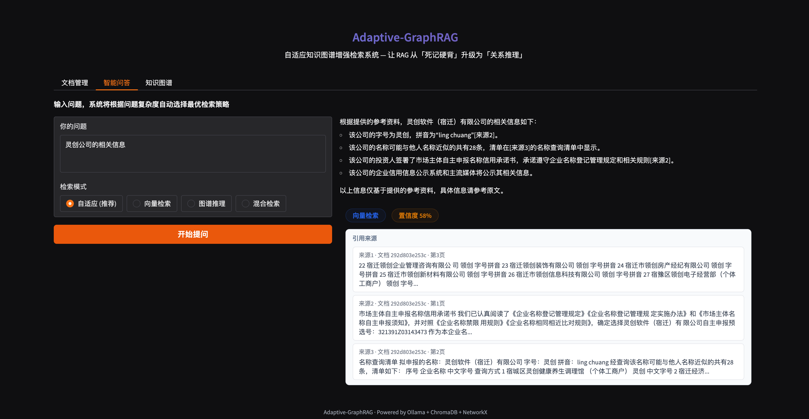
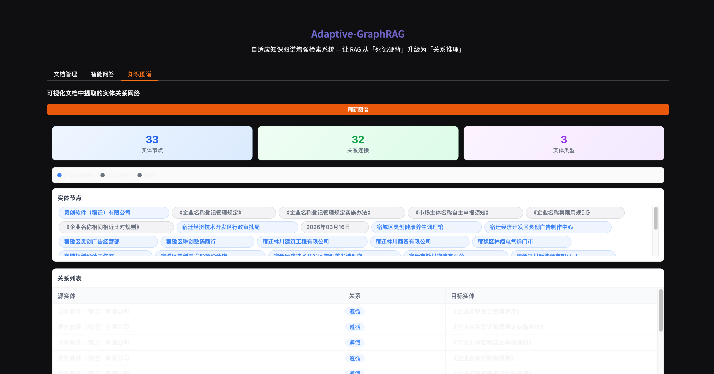

# Adaptive-GraphRAG

自适应知识图谱增强检索系统 —— 让 RAG 从「死记硬背」升级为「关系推理」。

[](https://www.python.org/downloads/)
[](LICENSE)

## 简介

轻量级、**本地优先**的智能文档问答系统：上传 PDF 后自动完成分块、向量索引与知识图谱构建；提问时通过**自适应路由**在向量检索、图谱推理与混合检索（RRF 融合）之间切换，并输出带引用与推理路径的回答。

## 相关文档

| 文档 | 说明 |
|------|------|
| [Ollama 部署与本地大模型配置](docs/ollama-deployment.md) | 安装 Ollama、拉取对话/嵌入模型、与 `.env` 对齐及常见问题 |

## 功能特性

| 能力 | 说明 |
|------|------|
| 自适应检索 | 规则引擎识别问题类型，自动选择 `vector` / `graph` / `hybrid`，也可在界面手动指定 |
| 轻量 GraphRAG | 使用 Ollama 从文本块抽取实体与关系，NetworkX 存图并支持最短路径与邻域检索 |
| 向量检索 | ChromaDB 持久化 + Ollama 嵌入模型（如 `nomic-embed-text`） |
| Web 界面 | **Vue 3**（`/app/`）与 **Gradio**（`/ui`）并存：文档管理、智能问答、知识图谱（Cytoscape） |
| REST API | FastAPI 提供上传、查询、图谱统计等接口（Vue 与 Gradio 共用） |

## 技术栈

`FastAPI` · `Vue 3` · `Vite` · `Gradio` · `ChromaDB` · `NetworkX` · `PyMuPDF` · `Ollama` · `Pydantic`

## 系统架构

```text
用户 (Vue / Gradio / HTTP API)
        │
        ▼
   FastAPI 应用
        │
        ├── QueryClassifier（规则：关键词 + 正则）
        │
        ├── VectorRetriever ──► ChromaDB + Ollama Embedding
        ├── GraphRetriever  ──► NetworkX（路径 / 邻域）
        └── HybridFusion    ──► RRF 融合向量 + 图谱结果
        │
        ▼
   Ollama Chat（生成回答 + 摘要 + 实体抽取）
```

## 界面预览

本地用编辑器预览 Markdown 时，只要 `README.md` 与 `docs/` 在同一仓库目录下且文件存在，一般可以正常显示。

### 文档管理



### 智能问答



### 知识图谱




## 环境要求

- Python **3.12+**（推荐与当前依赖 wheel 一致）
- **[Ollama](https://ollama.com/)** 已安装并运行；**完整部署步骤、模型拉取与排错**见 [docs/ollama-deployment.md](docs/ollama-deployment.md)。

简要检查清单：

- 服务可访问：`http://localhost:11434`（或通过 `OLLAMA_HOST` 指定）
- **对话 / 抽取**模型：名称与 `LLM_MODEL` 一致（如 `llama3.1:8b`）
- **嵌入**模型：名称与 `EMBEDDING_MODEL` 一致（推荐 `nomic-embed-text`）

```bash
ollama pull llama3.1:8b
ollama pull nomic-embed-text
```

## 本机运行环境（已验证）

以下为**当前用于开发与运行本项目的电脑**配置，在本地实测可完成 PDF 上传、向量索引、图谱构建与 Gradio 问答。他人机器只需满足上文 [环境要求](#环境要求) 即可，不必与此表完全一致。

| 项目 | 说明 |
|------|------|
| 操作系统 | macOS **26.3**（**arm64** / Apple Silicon） |
| 内存 | **16 GB** |
| Python | **3.14.3**（项目内虚拟环境 `.venv`，依赖见 `requirements.txt`） |
| Ollama 服务 | `http://localhost:11434`（本机默认端口） |
| 本机已安装的 Ollama 模型 | `llama3.1:8b`，`llama3.1:8b-4k`，`llama3.1:8b-16k`，`nomic-embed-text` |
| 本项目当前使用的模型 | 对话 / 抽取：`llama3.1:8b`；嵌入：`nomic-embed-text`（与 [`config.py`](config.py) 默认一致，可通过 `.env` 覆盖） |

> 若你更换电脑或升级系统，可自行修改本小节表格内容，或改为在文档中写「最低配置」而删除具体版本号。

## 快速开始

```bash
git clone https://github.com/CoderX42/Adaptive-GraphRAG.git
cd Adaptive-GraphRAG

python3 -m venv .venv
source .venv/bin/activate   # Windows: .venv\Scripts\activate

pip install -r requirements.txt

cp .env.example .env        # 按需修改模型名与路径

python main.py
```

- **Vue 界面（生产）**：先在前端目录执行 `npm run build`，再启动后端；访问 <http://localhost:8000/>（会重定向到 <http://localhost:8000/app/>）
- **Vue 开发模式**：见下文 [前端开发（Vue）](#前端开发vue)
- **Gradio 界面**：<http://localhost:8000/ui>
- **OpenAPI 文档**：<http://localhost:8000/docs>

### 前端开发（Vue）

前端源码在 `frontend/`（Vite + Vue 3 + TypeScript）。开发时建议**两个终端**：后端 `python main.py`（默认 `8000`），前端 `cd frontend && npm install && npm run dev`（默认 Vite `5173`）。`vite.config.ts` 已将 `/api` 代理到 `http://127.0.0.1:8000`，避免跨域。

开发地址请使用 **<http://localhost:5173/app/>**（与生产路径 `/app` 一致）。直接打开 `http://localhost:5173/` 会 302 跳到 `/app/`；`npm run dev` 也会尝试自动打开该路径。若页面空白或接口报错，请先确认后端已在 `8000` 端口运行。

生产环境由 FastAPI 挂载 `frontend/dist` 到路径 **`/app`**（`base: '/app/'`），与 Gradio 的 `/ui` 可并存。

```bash
cd frontend
npm install
npm run build    # 产出 dist/，供 FastAPI StaticFiles 使用
```

若希望单命令并行启动，可在本机安装 [concurrently](https://www.npmjs.com/package/concurrently) 后自行组合，例如：`concurrently "python main.py" "cd frontend && npm run dev"`（需在项目根目录、已激活 Python 虚拟环境）。

## 配置说明

复制 `.env.example` 为 `.env`，常用项如下：

| 变量 | 说明 | 默认 |
|------|------|------|
| `LLM_MODEL` | Ollama 对话模型 | `llama3.1:8b` |
| `OLLAMA_HOST` | Ollama 服务地址 | `http://localhost:11434` |
| `EMBEDDING_MODEL` | 嵌入模型 | `nomic-embed-text` |
| `CHUNK_SIZE` / `CHUNK_OVERLAP` | 分块大小与重叠 | `512` / `128` |
| `TOP_K` | 检索返回条数 | `5` |

数据目录（可在 `.env` 中覆盖）：

- `data/raw_docs/`：上传的 PDF 副本  
- `data/chroma_db/`：Chroma 向量库  
- `data/graph_cache.pkl`：图谱序列化  
- `data/metadata.db`：SQLite 文档元数据  

## API 摘要

| 方法 | 路径 | 说明 |
|------|------|------|
| `POST` | `/api/v1/documents/upload` | 上传 PDF，解析、向量化、建图 |
| `GET` | `/api/v1/retrieval/query` | 查询，`mode=auto\|vector\|graph\|hybrid` |
| `GET` | `/api/v1/documents` | 文档列表 |
| `GET` | `/api/v1/graph/visualize` | 图谱子图 / 全图数据（JSON） |
| `GET` | `/api/v1/graph/stats` | 节点数、边数 |

## 项目结构

```text
Adaptive-GraphRAG/
├── main.py                 # FastAPI 入口 + Gradio /ui + Vue 静态资源 /app
├── frontend/               # Vue 3 + Vite（npm run dev / npm run build）
├── config.py               # 配置（Pydantic Settings）
├── requirements.txt
├── .env.example
├── docs/
│   └── ollama-deployment.md  # Ollama 与本地大模型部署说明
├── core/                   # 路由、图谱构建、生成、检索器
├── storage/                # Chroma、SQLite、NetworkX
├── processors/             # PDF、分块
├── ui/                     # Gradio 界面
├── prompts/                # Jinja2 提示模板
└── data/                   # 运行时数据（建议加入 .gitignore）
```

## 常见问题

1. **嵌入报错 404**  
   Chroma 的 `OllamaEmbeddingFunction` 应使用 **Ollama 根地址**（如 `http://localhost:11434`），不要拼 `/api/embed` 路径。

2. **Gradio 热重载后旧会话报错**  
   开发模式下修改代码触发重载后，浏览器可能出现 `on_query` 输入数量不匹配；**刷新页面**即可。

3. **模型名与本地不一致**  
   在 `.env` 中设置 `LLM_MODEL` / `EMBEDDING_MODEL` 与 `ollama list` 中名称一致；详见 [Ollama 部署文档](docs/ollama-deployment.md)。

## 开发

```bash
source .venv/bin/activate
pytest tests/ -q          # 若有测试目录
```

前端日常开发：见 [前端开发（Vue）](#前端开发vue)；访问 Vite 开发服务器（一般为 <http://localhost:5173/app/>，具体以终端输出为准）。

## 致谢

思路参考传统 RAG 与 GraphRAG 结合、多路召回与融合等实践；嵌入与对话由 [Ollama](https://ollama.com/) 提供。


